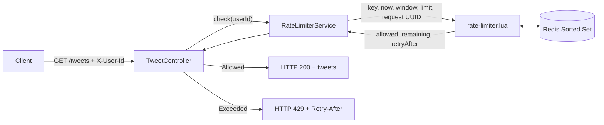
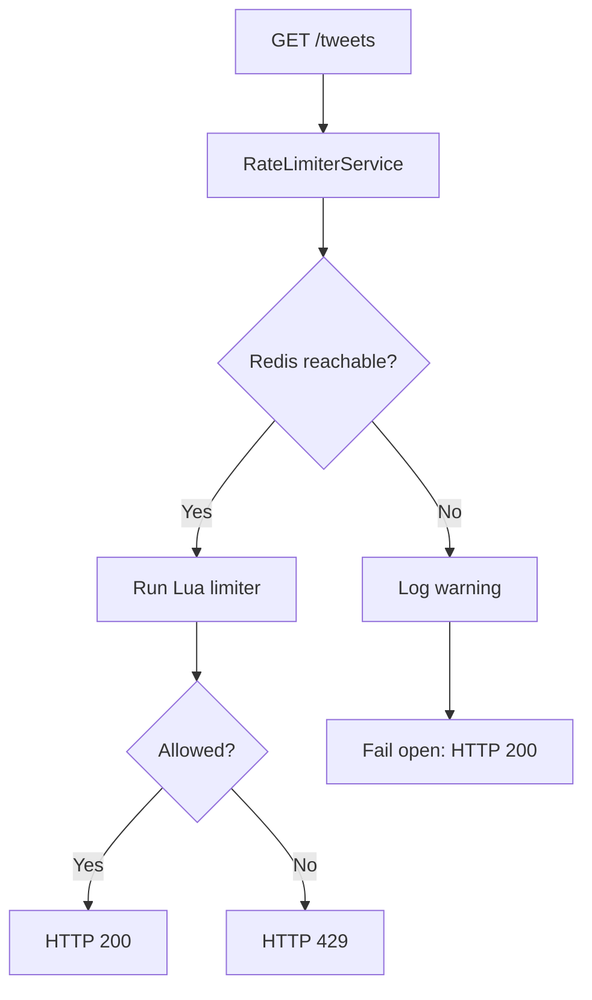

# Redis Sliding-Window Rate Limiter

> Distributed API rate limiting with Java 21, Spring Boot 4, Redis Sorted Sets, and atomic Lua scripting.


This project implements a production-inspired rate limiter for `GET /tweets`.
It allows **10 requests per rolling 60 seconds per user** and rejects excess traffic with **HTTP 429 Too Many Requests** plus a `Retry-After` header.

The implementation is intentionally compact: one API, one Redis data model, one atomic Lua script, and one clear resilience decision.

## Table of Contents

- [What This Demonstrates](#what-this-demonstrates)
- [System Behavior](#system-behavior)
- [Architecture](#architecture)
- [Request Flow](#request-flow)
- [Redis Data Model](#redis-data-model)
- [Why Sliding Window](#why-sliding-window)
- [Why Lua](#why-lua)
- [Fail-Open Resilience](#fail-open-resilience)
- [Quick Start](#quick-start)
- [API Examples](#api-examples)
- [Testing Guide](#testing-guide)
- [Redis Inspection](#redis-inspection)
- [Project Structure](#project-structure)
- [Interview Notes](#interview-notes)
- [Future Improvements](#future-improvements)
- [Verification Status](#verification-status)

## What This Demonstrates

| Area | Evidence in this repository |
|---|---|
| Java 21 | Maven project configured with Java 21 |
| Spring Boot 4 | REST endpoint implemented with Spring Boot Web MVC |
| Redis integration | `StringRedisTemplate` executes a Redis Lua script |
| Distributed state | Limits are stored in Redis, not local JVM memory |
| Sliding-window limiting | Request timestamps are tracked per user |
| Atomic concurrency | Redis Lua performs cleanup, count, decision, and insert as one operation |
| Docker | Redis runs locally as a Docker container |
| Resilience | Redis connection failure logs a warning and fails open |
| API design | Uses `200`, `429`, `X-RateLimit-Remaining`, and `Retry-After` |

## System Behavior

| Rule | Current implementation |
|---|---|
| Protected endpoint | `GET /tweets` |
| Demo user identity | Required `X-User-Id` request header |
| Limit | 10 requests |
| Window | Rolling 60 seconds |
| Success | HTTP `200` with `X-RateLimit-Remaining` |
| Rejection | HTTP `429` with `Retry-After` |
| Redis key scope | One key per user for `GET /tweets` |
| Redis failure | Fail open and log a warning |

`X-User-Id` is used only for this demo. In a production system, the user identity should come from a verified JWT, session, OAuth principal, or Spring Security context.

## Architecture



Production placement:

```text
Client
  |
  v
API Gateway / Reverse Proxy
  |  authentication, routing, coarse traffic controls
  v
Spring Boot service
  |  endpoint-specific rate-limit decision
  v
Redis
```

This project keeps the limiter inside the Spring Boot service so the algorithm is easy to inspect. In a larger system, the same policy could be enforced at an API Gateway before traffic reaches downstream services.

## Request Flow

1. Client sends `GET /tweets` with `X-User-Id`.
2. `TweetController` calls `RateLimiterService.check(userId)`.
3. `RateLimiterService` creates a key such as `rate-limit:GET-tweets:user123`.
4. Java sends Redis the key, current timestamp, window size, limit, and a request UUID.
5. Lua removes expired timestamps from the sorted set.
6. Lua counts the valid requests still inside the rolling 60-second window.
7. If count is below 10, Lua stores the current request.
8. If count is already 10, Lua calculates when the oldest request expires.
9. The controller returns either `HTTP 200` or `HTTP 429`.

## Redis Data Model

Redis key:

```text
rate-limit:GET-tweets:user123
```

Redis value:

```text
Sorted Set
```

| Sorted Set field | Meaning |
|---|---|
| Score | Request timestamp in milliseconds |
| Member | Unique request UUID |

Conceptually:

```text
rate-limit:GET-tweets:user123
    |-- score: 1720000000000, member: request-uuid-1
    |-- score: 1720000001200, member: request-uuid-2
    `-- score: 1720000003400, member: request-uuid-3
```

Redis commands used by the algorithm:

| Command | Purpose |
|---|---|
| `ZREMRANGEBYSCORE` | Remove timestamps older than the rolling window |
| `ZCARD` | Count valid requests still inside the window |
| `ZRANGE ... WITHSCORES` | Find the oldest request and calculate retry time |
| `ZADD` | Store the current request timestamp |
| `EXPIRE` | Automatically remove inactive user keys |

## Why Sliding Window

A fixed-window counter can allow boundary bursts:

```text
10 requests at 10:00:59
10 requests at 10:01:01
= 20 requests in 2 seconds
```

A sliding-window log avoids this by tracking each request timestamp individually. A request expires only when it is older than 60 seconds, not when the wall-clock minute changes.

| Algorithm | Strength | Trade-off |
|---|---|---|
| Fixed window | Simple | Boundary bursts |
| Sliding-window log | Accurate | Stores one entry per recent request |
| Sliding-window counter | Lower memory | Approximate |
| Token bucket | Allows controlled bursts | Different semantics |
| Leaky bucket | Smooths traffic | Can queue or drop requests |

This project uses a sliding-window log because it is exact, readable, and easy to inspect in Redis.

## Why Lua

Running Redis commands separately from Java can produce a race condition:

```text
Redis contains 9 requests.
Request A reads count = 9.
Request B reads count = 9.
Both are allowed.
Final count becomes 11.
```

The Lua script makes the critical section atomic:

```text
Remove expired -> Count valid -> Decide -> Add or reject
```

Redis includes Lua support, so no separate Lua installation is required. Java still owns the application flow; Lua owns only the concurrency-sensitive Redis decision.

Core script behavior:

```lua
redis.call('ZREMRANGEBYSCORE', key, '-inf', cutoff)

local count = redis.call('ZCARD', key)

if count >= limit then
    local oldest = redis.call('ZRANGE', key, 0, 0, 'WITHSCORES')
    local retryAfter = math.ceil((oldest[2] + window - now) / 1000)
    return {0, 0, retryAfter}
end

redis.call('ZADD', key, now, requestId)
redis.call('EXPIRE', key, math.ceil(window / 1000))

local remaining = limit - count - 1
return {1, remaining, 0}
```

## Fail-Open Resilience

This read API chooses availability when Redis is unavailable.



Current Redis timeout configuration:

```properties
spring.data.redis.connect-timeout=1s
spring.data.redis.timeout=1s
```

Fail-open is suitable here because `GET /tweets` is a read API. Payment, login, abuse-prevention, or security-sensitive APIs may prefer fail-closed behavior.

## Quick Start

### Start Redis

```powershell
docker run -d --name rate-limiter-redis -p 6380:6379 redis:7-alpine
```

If the container already exists:

```powershell
docker start rate-limiter-redis
```

Verify Redis:

```powershell
docker exec -it rate-limiter-redis redis-cli PING
```

Expected:

```text
PONG
```

### Run the application

Windows:

```powershell
.\mvnw.cmd spring-boot:run
```

Linux or macOS:

```bash
./mvnw spring-boot:run
```

Compile:

```powershell
.\mvnw.cmd -DskipTests compile
```

Run tests:

```powershell
.\mvnw.cmd test
```

## API Examples

Request:

```http
GET http://localhost:8080/tweets
X-User-Id: user123
```

Windows:

```powershell
curl.exe -i -H "X-User-Id: user123" http://localhost:8080/tweets
```

Success:

```http
HTTP/1.1 200
X-RateLimit-Remaining: 9
Content-Type: application/json

[
  "Tweets requested by user123",
  "Learning system design",
  "Building a distributed rate limiter"
]
```

Rejected:

```http
HTTP/1.1 429
Retry-After: 60
Content-Type: text/plain

Too Many Requests
```

## Testing Guide

Send 11 requests with the same user id:

```powershell
$user = "demo-" + [guid]::NewGuid().ToString("N")

foreach ($i in 1..11) {
    try {
        $response = Invoke-WebRequest `
            -Uri "http://localhost:8080/tweets" `
            -Headers @{ "X-User-Id" = $user } `
            -UseBasicParsing

        [PSCustomObject]@{
            Request = $i
            Status = $response.StatusCode
            Remaining = $response.Headers["X-RateLimit-Remaining"]
            RetryAfter = $response.Headers["Retry-After"]
        }
    } catch {
        [PSCustomObject]@{
            Request = $i
            Status = [int]$_.Exception.Response.StatusCode
            Remaining = $null
            RetryAfter = $_.Exception.Response.Headers["Retry-After"]
        }
    }
}
```

Expected:

```text
Requests 1-10 -> HTTP 200
Request 11    -> HTTP 429 with Retry-After
```

Test fail-open:

```powershell
docker stop rate-limiter-redis
curl.exe -i -H "X-User-Id: fail-open-user" http://localhost:8080/tweets
docker start rate-limiter-redis
```

Expected: the request returns `HTTP 200`, and the application log contains:

```text
Redis unavailable; allowing request for user fail-open-user
```

## Redis Inspection

Open Redis CLI:

```powershell
docker exec -it rate-limiter-redis redis-cli
```

Find rate-limit keys:

```redis
SCAN 0 MATCH rate-limit:* COUNT 100
```

Inspect one user:

```redis
ZRANGE rate-limit:GET-tweets:user123 0 -1 WITHSCORES
```

Count current entries:

```redis
ZCARD rate-limit:GET-tweets:user123
```

Check expiration:

```redis
TTL rate-limit:GET-tweets:user123
```

Clear only one test user:

```redis
DEL rate-limit:GET-tweets:user123
```

## Project Structure

```text
rate-limiter/
|-- pom.xml
|-- requests.http
|-- mvnw
|-- mvnw.cmd
|-- src/
|   |-- main/
|   |   |-- java/com/dennymathew/ratelimiter/
|   |   |   |-- RateLimiterApplication.java
|   |   |   |-- ratelimit/
|   |   |   |   |-- RateLimitResult.java
|   |   |   |   `-- RateLimiterService.java
|   |   |   `-- tweet/
|   |   |       `-- TweetController.java
|   |   `-- resources/
|   |       |-- application.properties
|   |       `-- rate-limiter.lua
|   `-- test/java/com/dennymathew/ratelimiter/
|       `-- RateLimiterApplicationTests.java
`-- README.md
```

| File | Purpose |
|---|---|
| `TweetController.java` | Handles `GET /tweets` and maps limiter decisions to HTTP responses |
| `RateLimiterService.java` | Builds Redis keys, executes Lua, and handles Redis fail-open behavior |
| `RateLimitResult.java` | Carries `allowed`, `remaining`, and `retryAfterSeconds` |
| `rate-limiter.lua` | Atomic sliding-window algorithm |
| `application.properties` | Redis host, port, and timeout configuration |
| `requests.http` | IntelliJ HTTP request examples |
| `pom.xml` | Spring Boot, Redis, Web MVC, test dependencies, Java 21 |

## Interview Notes

**30-second explanation:**
This is a Java 21 and Spring Boot 4 rate limiter for `GET /tweets`. It uses Redis Sorted Sets to store per-user request timestamps and a Redis Lua script to make the limit decision atomically. Each user gets 10 requests per rolling 60 seconds. Allowed requests return `200`; exceeded requests return `429` with `Retry-After`. If Redis is down, the read API fails open and logs a warning.

**Why Redis?**
Redis provides fast shared state, which lets multiple application instances enforce the same user limit.

**Why Sorted Set?**
Sorted Sets store request timestamps as scores, so old requests can be removed and the oldest request can be found efficiently.

**Why not a normal counter?**
A counter is easy but imprecise at fixed-window boundaries. A sliding-window log enforces the last 60 seconds exactly.

**Why Lua?**
The cleanup, count, decision, and insert must happen atomically. Lua prevents concurrent requests from interleaving those operations.

**How would this scale?**
Run multiple Spring Boot instances behind a load balancer or API Gateway. All instances use Redis as the shared decision store.

**How would authentication change this?**
Replace `X-User-Id` with a trusted user id from JWT claims or the Spring Security context.

## Future Improvements

These are not implemented yet:

- API Gateway integration
- JWT-based authentication
- Configurable limits per endpoint, user tier, or subscription plan
- Redis Cluster and replication
- Prometheus/Grafana metrics
- Testcontainers integration tests
- Concurrent load tests
- CI/CD pipeline
- Kubernetes deployment

## Verification Status

| Check | Status |
|---|---|
| Compilation | Passed with `.\mvnw.cmd -DskipTests compile` |
| Redis port | Configured for `localhost:6380` |
| Requests 1-10 | Verified as HTTP `200` |
| Request 11 | Verified as HTTP `429` |
| Lua limiter | Verified against Redis |
| Redis-down behavior | Verified as fail-open HTTP `200` |
| Warning log | Verified in application output |
| Maven tests | Locally blocked by Maven Central PKIX trust-store issue |

## Purpose

This repository is a focused high-level design and backend engineering exercise. It shows how a small Spring Boot service can use Redis and Lua to enforce a precise distributed rate limit while making an explicit availability trade-off when Redis fails.
