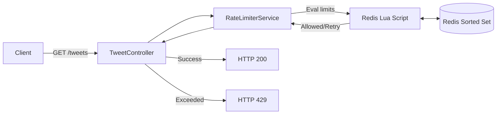

# Redis Sliding-Window Rate Limiter 🚦

> A highly-scalable Java 21 & Spring Boot 4 API rate limiter backed by Redis Sorted Sets and atomic Lua scripting.

   

This project demonstrates a production-grade distributed API rate limiter built to protect an example `GET /tweets` endpoint. It enforces a strict limit of **10 requests per rolling 60 seconds** per user, falling back to HTTP `429 Too Many Requests` when limits are exceeded.

## 🚀 Key Highlights & Learnings

- **Distributed State Management:** Centralized rate limiting via Redis ensures consistent enforcement across multiple horizontally scaled application instances.
- **Sliding-Window Precision:** Utilized Redis Sorted Sets (`ZADD`, `ZREMRANGEBYSCORE`, `ZCARD`) to maintain precise timestamps for requests, avoiding the boundary-burst vulnerabilities of fixed-window counters.
- **Atomic Concurrency with Lua:** Leveraged Redis Lua scripting to execute the entire read-evaluate-write cycle atomically, eliminating race conditions during high-concurrency traffic.
- **Fail-Open Resilience:** Engineered robust failure handling. If Redis becomes unavailable, the system intelligently defaults to a fail-open state, preserving API availability while logging a critical warning.
- **System Design Trade-Offs:** Deep practical exploration of HLD concepts: CAP theorem (prioritizing Availability during network partitions), sliding-window vs. token bucket, and Redis-backed distributed synchronization.

## 🏗️ Architecture Flow



## ⚙️ Quick Start

```bash
# 1. Start Redis Backend
docker run -d --name rate-limiter-redis -p 6380:6379 redis:7-alpine

# 2. Compile and Run Application
.\mvnw.cmd spring-boot:run

# 3. Test Rate Limiting
curl -i -H "X-User-Id: user123" http://localhost:8080/tweets
```

## 🧠 Behind the Logic

The system identifies authenticated requests via an `X-User-Id` header (representing a JWT or session identifier in production). The evaluation logic flows as follows:

1. The request timestamp is passed to Redis.
2. An atomic Lua script cleans up records older than 60 seconds (`ZREMRANGEBYSCORE`).
3. Current valid requests within the rolling window are counted (`ZCARD`).
4. If `< 10`, the new request timestamp is recorded (`ZADD`) and the request is allowed (HTTP `200`).
5. If `>= 10`, the script calculates precisely when the oldest request expires and rejects the request, providing a `Retry-After` header (HTTP `429`).
